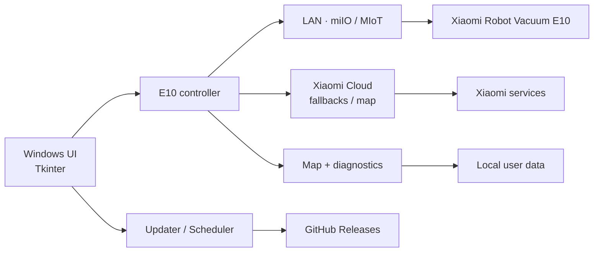

# Aspiradora Xiaomi

### Advanced Windows control for the Xiaomi Robot Vacuum E10

An independent desktop application to control, observe and extend the **Xiaomi Robot Vacuum E10** (`xiaomi.vacuum.b112`) from a PC.

[Español](README.md) · [Download](https://github.com/Yakoderaa/Aspiradora-Xiaomi/releases/latest) · [Documentation](docs/INSTALLATION.md) · [Roadmap](docs/ROADMAP.md)

 

Official Xiaomi product image used for reference. This project is not affiliated with, sponsored by or endorsed by Xiaomi.

---

## What is this?

**Aspiradora Xiaomi** is an independent Windows controller built specifically around the real-world behaviour of the Xiaomi Robot Vacuum E10.

The project goes beyond a basic remote control. It explores local MIoT communication, an independent mapping pipeline, diagnostics, automation, update delivery and an experimental anti-stall system.

> [!IMPORTANT]
> This project is under **active development**. Core robot control is usable; custom mapping and anti-stall behaviour remain experimental and are being validated specifically against `xiaomi.vacuum.b112`.

## Current status

| Area | Status |
| --- | --- |
| Local E10 connection | ✅ Working |
| Battery, state and consumables | ✅ Working |
| Start / stop cleaning | ✅ Working |
| Return to dock | ✅ Working |
| Suction and water controls | ✅ Working |
| Manual control | ✅ Working |
| Xiaomi account / token linking | ✅ Working |
| GitHub Release updates | ✅ Working |
| Two-step custom mapping | 🧪 Experimental |
| B112 map retrieval / reconstruction | 🧪 Experimental |
| Point / zone / local-room cleaning | 🧪 Evolving |
| Anti-stall system | 🧪 In development |
| Android / iOS | 🗺️ Future roadmap |

## Why this project exists

The E10 exposes a different and more limited mapping experience than higher-end Xiaomi models. This project aims to build a more capable, transparent controller around the actual protocol exposed by the vacuum instead of assuming that behaviour from other devices also applies to the B112.

## Mapping

The experimental mapping flow currently uses two passes: an edge/perimeter pass followed by an interior pass after the robot is confirmed back at the dock. The implementation validates B112-specific MIoT behaviour, including `build-map-ii` responses and known empty-result quirks handled by `python-miio`.

See **[Mapping notes](docs/MAPPING.md)** for the current technical status.

## Quick install

1. Open the **[latest Release](https://github.com/Yakoderaa/Aspiradora-Xiaomi/releases/latest)**.
2. Download `Aspiradora-Xiaomi-Setup.exe`.
3. Install it on Windows 10/11 x64.
4. Link your E10 from the application.
5. Keep the PC and robot reachable on the same local network.

A PC connected through Ethernet can control an E10 connected through Wi‑Fi as long as both are on the same reachable network.

## Architecture

The current Windows application uses **Python 3.12 + Tkinter**, `python-miio`, PyInstaller and Inno Setup.

## Privacy and security

Xiaomi passwords are not stored. Local tokens are protected with Windows DPAPI. Diagnostic output is designed to avoid exposing full tokens, signed FDS URLs or credentials.

Never post secrets or personal configuration files in a public issue.

## Future

The immediate goal is a reliable E10 implementation on Windows. Once the device protocol and mapping pipeline are stable, the project can separate the communication core from the UI and evaluate **Android and iOS** clients.

See the **[roadmap](docs/ROADMAP.md)**.

## Documentation

- [Installation](docs/INSTALLATION.md)
- [Mapping](docs/MAPPING.md)
- [Architecture](docs/ARCHITECTURE.md)
- [Roadmap](docs/ROADMAP.md)
- [FAQ](docs/FAQ.md)
- [Changelog](CHANGELOG.md)
- [Contributing](CONTRIBUTING.md)
- [Security](SECURITY.md)
- [Third-party notices](THIRD_PARTY_NOTICES.md)

## Disclaimer

Xiaomi, Mi Home and Xiaomi Robot Vacuum are trademarks of their respective owners. This is an independent community project and is not affiliated with or endorsed by Xiaomi.
