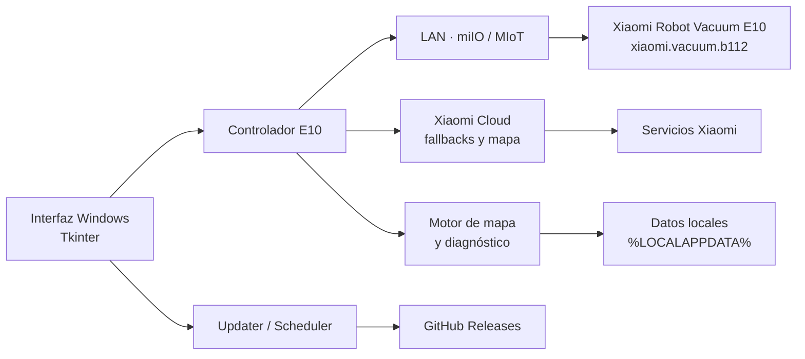

<div align="center">

# Aspiradora Xiaomi

### Control avanzado para Xiaomi Robot Vacuum E10 desde Windows

Una aplicación de escritorio independiente para controlar, observar y ampliar las capacidades de la **Xiaomi Robot Vacuum E10** (`xiaomi.vacuum.b112`) desde una PC.

[English](README.en.md) · [Descargar](https://github.com/Yakoderaa/Aspiradora-Xiaomi/releases/latest) · [Documentación](docs/INSTALLATION.md) · [Roadmap](docs/ROADMAP.md)

[](https://github.com/Yakoderaa/Aspiradora-Xiaomi/releases/latest)
[](https://github.com/Yakoderaa/Aspiradora-Xiaomi/actions/workflows/build-release.yml)
[](https://github.com/Yakoderaa/Aspiradora-Xiaomi/actions/workflows/codeql.yml)


<br>


<sub>Imagen oficial del producto publicada por Xiaomi. Proyecto independiente: no afiliado, patrocinado ni aprobado por Xiaomi.</sub>

</div>

---

## ¿Qué es este proyecto?

**Aspiradora Xiaomi** nació para tener un control del E10 más completo desde una PC y para investigar capacidades que la experiencia oficial de Mi Home no expone de la misma forma que en modelos superiores.

El objetivo no es copiar Mi Home. La aplicación construye su propia experiencia alrededor del E10: control local, diagnóstico MIoT, mapeo experimental, automatización, actualización desde GitHub y un sistema antiatasco en desarrollo.

> [!IMPORTANT]
> El proyecto está en **desarrollo activo**. El control básico del robot es utilizable, mientras que el mapeo propio y el sistema antiatasco continúan en fase experimental y se validan específicamente sobre `xiaomi.vacuum.b112`.

### El hardware que estamos llevando más lejos

<table>
  <tr>
    <td width="33%" align="center">
      
      <br><sub>Planificación y recorrido</sub>
    </td>
    <td width="33%" align="center">
      
      <br><sub>Sensores y entorno</sub>
    </td>
    <td width="33%" align="center">
      
      <br><sub>Diseño compacto</sub>
    </td>
  </tr>
</table>

<p align="center"><sub>Fotografías oficiales de Xiaomi utilizadas únicamente como referencia del dispositivo compatible.</sub></p>

## Estado actual

| Área | Estado |
| --- | --- |
| Conexión local al E10 | ✅ Operativa |
| Estado, batería y consumibles | ✅ Operativo |
| Iniciar / detener limpieza | ✅ Operativo |
| Volver a la base | ✅ Operativo |
| Succión y nivel de agua | ✅ Operativo |
| Control manual | ✅ Operativo |
| Vinculación mediante Xiaomi / token | ✅ Operativa |
| Actualizaciones desde GitHub Releases | ✅ Operativas |
| Mapeo propio en dos pasos | 🧪 Experimental |
| Lectura / reconstrucción del mapa B112 | 🧪 Experimental |
| Limpieza por punto / zona / habitación local | 🧪 En evolución |
| Sistema antiatasco | 🧪 En desarrollo |
| Android / iOS | 🗺️ Planificado a futuro |

## Funciones

La aplicación incluye actualmente control del estado del robot, batería, depósito, mopa y consumibles; modos de limpieza; potencia de succión; caudal de agua; control direccional; regreso a la base; mapa local; limpieza por punto y zona; vinculación con Xiaomi; almacenamiento protegido del token mediante Windows DPAPI; actualizaciones automáticas y herramientas de diagnóstico específicas del E10.

Una parte importante del proyecto está dedicada a comprender el comportamiento real del servicio MIoT del B112. Algunos valores del firmware no se comportan como sugieren otras aspiradoras Xiaomi, por lo que el proyecto evita asumir compatibilidad entre modelos.

## Mapeo propio

El E10 presenta varias particularidades de firmware. El proyecto está desarrollando una ruta de mapeo independiente que combina comunicación LAN MIoT, archivos de mapa disponibles en Xiaomi Cloud cuando existen y reconstrucción local.

El flujo experimental actual utiliza dos recorridos:

1. **Paso 1 — bordes:** recorre el perímetro y detecta el regreso a la base.
2. **Paso 2 — interior:** completa la superficie después de confirmar físicamente que el robot volvió a la base.

La app también valida respuestas específicas del B112, incluido el comportamiento de `build-map-ii` y respuestas MIoT con resultado vacío reparadas por `python-miio`.

Más detalles: **[Cómo funciona el mapeo](docs/MAPPING.md)**.

## Instalación rápida

1. Abrí la **[última Release](https://github.com/Yakoderaa/Aspiradora-Xiaomi/releases/latest)**.
2. Descargá `Aspiradora-Xiaomi-Setup.exe`.
3. Instalalo en Windows 10/11 x64.
4. Vinculá tu E10 desde la aplicación.
5. Asegurate de que la PC y el robot estén en la misma red local.

La PC puede estar conectada por **Ethernet** y el E10 por **Wi‑Fi**; no necesitan usar el mismo tipo de conexión, sólo poder comunicarse a través del mismo router/red.

Guía completa: **[Instalación y primeros pasos](docs/INSTALLATION.md)**.

## Arquitectura



La aplicación está escrita actualmente en **Python 3.12 + Tkinter**. La comunicación local utiliza `python-miio`; PyInstaller genera el paquete Windows e Inno Setup crea el instalador.

Ver **[Arquitectura del proyecto](docs/ARCHITECTURE.md)**.

## Propiedad intelectual y seguridad

<table>
  <tr>
    <td width="50%" valign="top">
      <h3>Propiedad del proyecto</h3>
      <p>El código y documentación originales están identificados con aviso de copyright. El repositorio incluye una estrategia explícita para DNDA, marca y evaluación de patentabilidad técnica.</p>
      <p><strong>No se afirma ninguna patente ni “patent pending” que no exista.</strong></p>
      <p>→ <a href="COPYRIGHT.md">Copyright</a><br>
      → <a href="docs/INTELLECTUAL_PROPERTY.md">Propiedad intelectual</a></p>
    </td>
    <td width="50%" valign="top">
      <h3>Seguridad por diseño</h3>
      <p>El repositorio incorpora CodeQL, Dependabot, CODEOWNERS, smoke tests y una política de divulgación responsable para reducir riesgos en un software que controla un dispositivo físico.</p>
      <p>→ <a href="SECURITY.md">Política de seguridad</a><br>
      → <a href="docs/SECURITY_MODEL.md">Modelo de amenazas</a></p>
    </td>
  </tr>
</table>

La contraseña de Xiaomi **no se guarda**. El token local se protege con **Windows DPAPI** cuando corresponde y los diagnósticos están diseñados para no imprimir material sensible completo.

> [!CAUTION]
> Nunca publiques tokens miIO, contraseñas, cookies, claves derivadas ni URLs FDS firmadas completas. Las vulnerabilidades con impacto real deben reportarse de forma privada.


## Roadmap

La prioridad actual es terminar una implementación fiable para el E10 en Windows. Una vez estabilizado el protocolo y el mapeo, el proyecto podrá separar el motor de comunicación de la interfaz y evaluar clientes para **Android e iOS**, con una interfaz móvil compartida y capacidades equivalentes siempre que las restricciones de cada plataforma lo permitan.

Ver **[Roadmap completo](docs/ROADMAP.md)**.

## Documentación

| Documento | Contenido |
| --- | --- |
| [Instalación](docs/INSTALLATION.md) | Instalación, red, SmartScreen y actualización |
| [Mapeo](docs/MAPPING.md) | Estado del mapeo propio y comportamiento B112 |
| [Arquitectura](docs/ARCHITECTURE.md) | Capas, datos, build y decisiones técnicas |
| [Roadmap](docs/ROADMAP.md) | Windows, estabilización y futuro móvil |
| [FAQ](docs/FAQ.md) | Preguntas frecuentes |
| [Changelog](CHANGELOG.md) | Hitos importantes del desarrollo |
| [Contribuir](CONTRIBUTING.md) | Cómo reportar, probar y aportar cambios |
| [Seguridad](SECURITY.md) | Vulnerabilidades, secretos y divulgación responsable |
| [Modelo de seguridad](docs/SECURITY_MODEL.md) | Amenazas, límites de confianza y mitigaciones |
| [Propiedad intelectual](docs/INTELLECTUAL_PROPERTY.md) | Copyright, DNDA, marca y evaluación de patente |
| [Copyright](COPYRIGHT.md) | Aviso de autoría y terceros |
| [Third-party notices](THIRD_PARTY_NOTICES.md) | Dependencias y avisos de terceros |

## Desarrollo

```powershell
git clone https://github.com/Yakoderaa/Aspiradora-Xiaomi.git
cd Aspiradora-Xiaomi
py -3.12 -m venv .venv
.\.venv\Scripts\Activate.ps1
python -m pip install -r requirements.txt
```

El proyecto contiene una batería creciente de smoke tests para evitar regresiones en los comportamientos específicos del E10. El pipeline de publicación compila la aplicación, ejecuta los tests, verifica el ejecutable empaquetado y genera el instalador de Windows.

Para colaborar, leé **[CONTRIBUTING.md](CONTRIBUTING.md)** antes de abrir un Pull Request.

## Descargas

La versión distribuible oficial del proyecto se publica únicamente mediante **[GitHub Releases](https://github.com/Yakoderaa/Aspiradora-Xiaomi/releases)**. Cada release incluye:

- `Aspiradora-Xiaomi-Setup.exe`
- `Aspiradora-Xiaomi-Setup.exe.sha256`

## Aviso

Xiaomi, Mi Home y Xiaomi Robot Vacuum son marcas de sus respectivos propietarios. Este es un proyecto independiente y comunitario. No está afiliado ni respaldado por Xiaomi.

