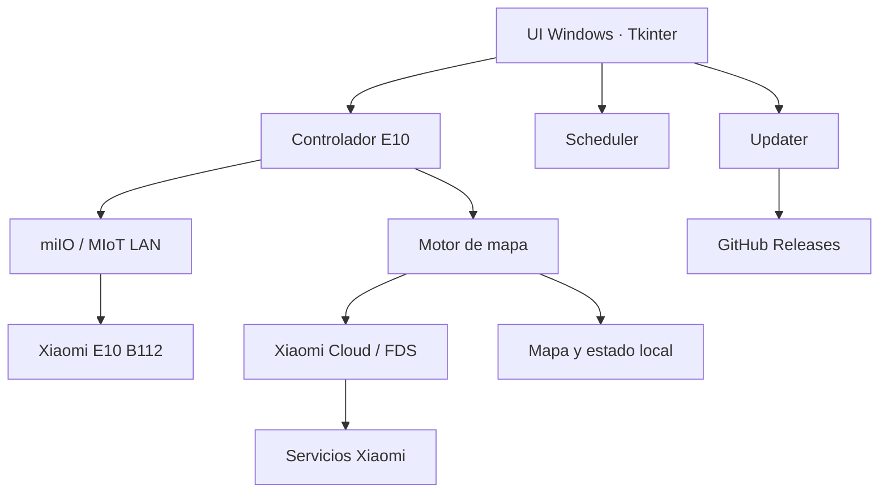

# Arquitectura

## Resumen

La aplicación se divide conceptualmente en cinco áreas: interfaz, control del E10, comunicación local, acceso Cloud/mapa y servicios auxiliares de Windows.

## Interfaz

La interfaz de Windows está construida con Tkinter. El proyecto sigue en una fase de iteración rápida, por lo que varias generaciones de módulos `app_vXX.py` permanecen encadenadas para conservar regresiones y comparar comportamientos.

A largo plazo conviene consolidar estas capas una vez que el protocolo del E10 quede estable.

## Controlador

La jerarquía de control encapsula acciones del robot: limpieza, base, potencia, agua, recorrido de borde, recorrido interior y acciones del servicio de mapa.

`python-miio` proporciona la capa de transporte miIO/MIoT. El proyecto agrega manejo específico para respuestas reales del B112 que no siempre coinciden con ejemplos genéricos.

## Mapa

El subsistema de mapa contiene:

- sondeo de propiedades MIoT;
- acciones oficiales de mapa;
- consulta Cloud;
- resolución de archivos FDS;
- decodificación IJAI/Xiaomi;
- validación de rejillas;
- persistencia del mapa local;
- diagnóstico de frescura y hashes.

El principio de diseño es no dibujar un mapa sólo porque un archivo pudo descifrarse. También debe superar validaciones estructurales y espaciales.

## Datos locales

Los datos personales de runtime no deben formar parte del repositorio.

Windows almacena configuración y mapa local dentro del perfil del usuario. Los secretos persistidos se protegen cuando corresponde mediante DPAPI.

## Build

El pipeline de Windows realiza, entre otras verificaciones:

1. instalación de dependencias;
2. `compileall`;
3. smoke tests acumulativos;
4. build PyInstaller;
5. self-test del ejecutable empaquetado;
6. smoke de arranque;
7. empaquetado Inno Setup;
8. SHA-256;
9. publicación y confirmación de assets en GitHub Releases.

Los cambios exclusivamente documentales están excluidos del pipeline de release para evitar generar una nueva versión de la aplicación por editar documentación.

## Actualizador

La aplicación consulta GitHub Releases, compara versiones y descarga el instalador cuando existe una versión nueva. El SHA-256 publicado se usa para verificar el archivo antes de ejecutar la actualización.

## Decisiones tecnológicas

### ¿Por qué Python ahora?

Python permite iterar muy rápido sobre un protocolo MIoT parcialmente documentado y aprovechar `python-miio`, parsers existentes y herramientas de diagnóstico.

### ¿Se mantendrá siempre?

No necesariamente. Una vez estabilizado el protocolo, el motor podría consolidarse o portarse. Para una futura interfaz móvil se evaluará separar claramente el núcleo de comunicación de la UI.

Ver [Roadmap](ROADMAP.md).
