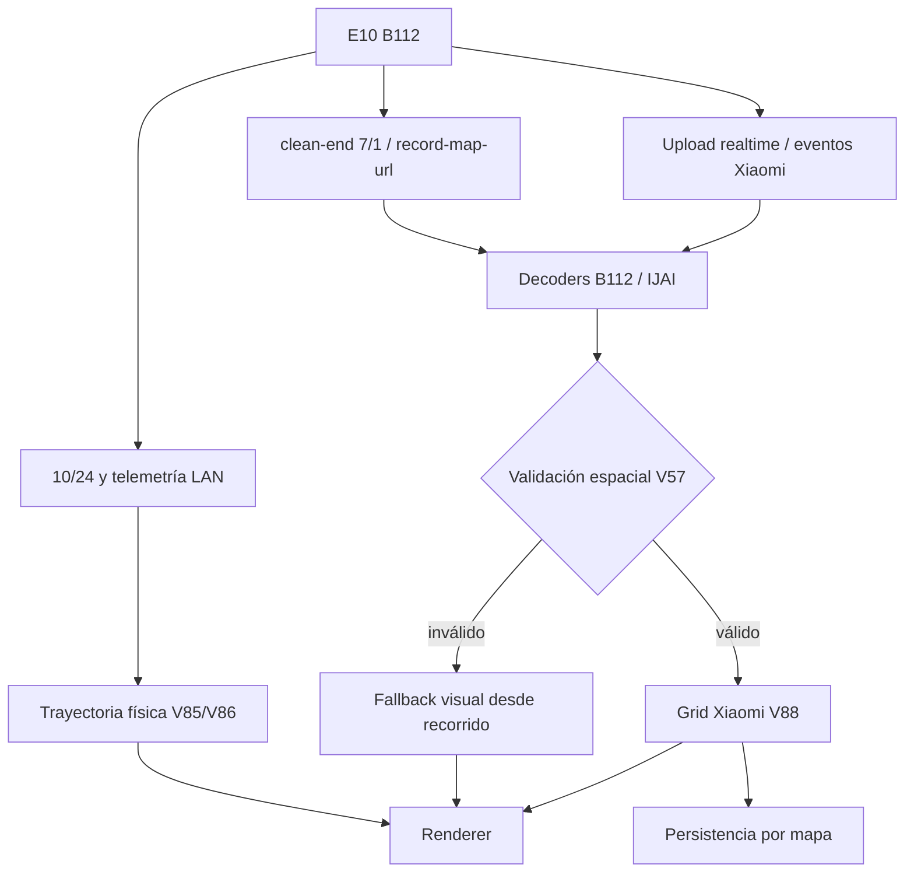

# Mapeo del Xiaomi Robot Vacuum E10

## Estado

El mapeo propio sigue siendo **experimental**, pero desde V78 el flujo ya no depende de dos pasadas artificiales de perímetro/interior. El E10 (`xiaomi.vacuum.b112`) realiza una limpieza/mapeo normal y la aplicación separa dos capas:

1. **Trayectoria física**: posición, continuidad, cobertura, antiatasco, regreso a base y ETA.
2. **Geometría visual**: planta de la habitación obtenida de Xiaomi cuando el mapa interno supera la validación espacial.

V88 mantiene esa separación para no deformar la trayectoria intentando hacer que “parezca” una habitación.

## Flujo actual

### 1. Inicio desde la base

La sesión toma el dock como referencia local. La base física permanece en el origen de la trayectoria, pero la geometría Xiaomi se alinea usando la celda de base del mapa.

El B112 puede publicar `255_255` como sentinela de posición. V88 nunca usa ese valor como coordenada visual: si la base queda fuera de la rejilla, se usa el centro físico `60_60` del grid 120×120.

### 2. Recorrido único

El robot realiza el barrido normal. La aplicación conserva las correcciones de continuidad V85 y la lógica de cobertura/antiatasco de las versiones anteriores sin alterar las coordenadas para “enderezar” el mapa.

### 3. Mapa Xiaomi

Durante y después de la limpieza se prueban las fuentes realtime y clean-end disponibles. Un grid descifrado sólo se acepta si supera la validación espacial V57:

- cantidad mínima de celdas conocidas;
- componente conexa suficientemente grande;
- relación entre componente principal y total;
- adyacencia suficiente para descartar islotes aleatorios.

Un blob descifrable pero espacialmente incoherente **no se dibuja ni se persiste**.

### 4. Persistencia V88

Cuando el grid es válido, V88 guarda por cada mapa:

- rejilla Xiaomi;
- resolución;
- celda de base corregida;
- fuente/hash/timestamp;
- métricas de validación.

Al reiniciar la aplicación o cambiar de mapa, cada mapa recupera su propia geometría. No se reutiliza el grid de otra vivienda/mapa.

### 5. Renderer estilo Mi Home

El mapa grande y las miniaturas usan la geometría Xiaomi validada como superficie, sin mostrar la cuadrícula interna. Desde V89 la vista normal muestra:

- contorno azul;
- relleno de la superficie;
- base;
- robot y orientación;
- habitaciones/zonas configuradas.

La trayectoria real continúa guardada completa y se usa para cobertura, completitud, antiatasco y diagnóstico F12, pero sus líneas internas no se dibujan en el mapa ni en las miniaturas.

La leyenda queda fija en la esquina superior izquierda y sólo identifica la fuente del mapa. La rueda controla el zoom y el doble clic con la rueda ejecuta **Zoom Extents**. El encuadre inicial conserva la base como centro de referencia.

Si Xiaomi todavía no entrega un grid válido, V88 usa el fallback de trayectoria de V87 a resolución de 10 cm en lugar de inventar una planta desde datos incoherentes.

## Fuentes de mapa

## Particularidades B112 cubiertas

- `10/17 build-map-ii` puede devolver ACK sin `code=0` convencional.
- `python-miio` contempla respuestas vacías reparables con `id` y `exe_time`.
- `map-privacy 10/23` tiene semántica específica del modelo.
- `robot-location 10/24` puede congelarse; no se toma como única prueba de movimiento.
- El archivo Cloud puede ser histórico; la frescura y la coherencia se validan antes de usarlo.
- `255_255` se trata como sentinela y nunca como una base real dentro del plano.

## Decoder B112 V91

V91 corrige la estructura binaria observada en el payload post-hex del E10. En las sesiones reales el bloque mide **3628 bytes** y se interpreta como:

- 1 byte de tipo variable;
- 1 byte de versión;
- 2 bytes big-endian de longitud de cabecera;
- 24 bytes de metadatos;
- 3600 bytes de grid 120×120 a 2 bits por celda.

El parser anterior esperaba un tipo fijo y una longitud de 3 bytes, por lo que descartaba estos mapas antes de probar la rejilla. V91 acepta la cabecera observada, prueba ambos órdenes 2bpp y separa las capas de valor antes de enviarlas al validador espacial V57.

La resolución candidata del grid pasa a **0,20 m**. Este cambio se aplica sólo al mapa/grid candidato; la cinemática física heredada de V77/V85 continúa en 0,10 m hasta tener evidencia suficiente para cambiarla sin afectar antiatasco, retorno o completitud.

Cuando no existe un grid Xiaomi válido, V91 mejora el fallback visual usando la huella física del robot, interpolación entre muestras, cierre de huecos cortos y relleno de huecos encerrados. El recorrido continúa oculto en la UI y disponible íntegro en F12.

## Gate de arranque V90

V90 separa explícitamente tres estados de una sesión nueva:

1. **Preparando**: el usuario inició el mapeo pero `v74_mapping_started` todavía no confirmó el START.
2. **START confirmado**: la orden fue aceptada para el serial vigente, pero el robot todavía debe demostrar que salió físicamente del dock.
3. **Salida confirmada**: después del START se observó `status 5/6/7`. Sólo desde este estado un posterior `status=3/4` puede representar un retorno real.

Esto evita que cambios tempranos de `10/24`, telemetría atrasada o un `status=4` que todavía pertenece al estado inicial del dock cierren el mapa con tiempo/cobertura cero.

Si el START no se confirma dentro de 60 segundos, V90 cancela el intento, ejecuta `stop + dock` y deja el motivo en F12. Un evento START que llegue después de esa cancelación se descarta y no reactiva la sesión.

## Diagnóstico F12

F12 conserva los bloques de diagnóstico históricos para comparar versiones. V88 añade la fuente visual activa, métricas del grid, base cruda/corregida y cantidad de actualizaciones/reutilizaciones persistidas.

## Qué falta para considerarlo estable

La implementación se considerará estable cuando las pruebas físicas repetidas confirmen:

- mapa fresco reproducible en distintos recorridos;
- geometría comparable de forma consistente con Mi Home;
- antiatasco sin falsos positivos en distintos muebles/esquinas;
- retorno a base fiable en la rampa real;
- limpieza por habitación/zona apoyada en una planta validada;
- recuperación segura ante pérdida de red o respuestas MIoT inesperadas.

Los comandos de voz personalizados quedan deliberadamente fuera de esta etapa y se evaluarán más adelante con un paquete compatible y restauración segura.
