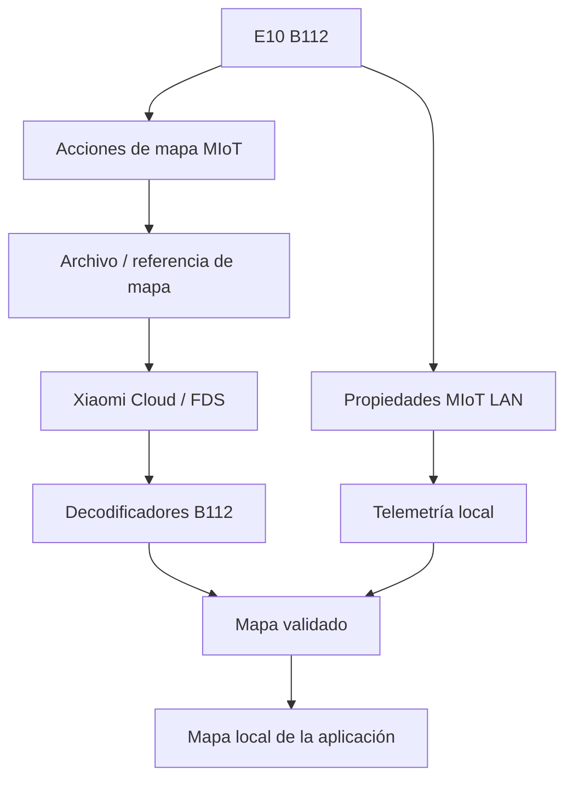

# Mapeo del Xiaomi Robot Vacuum E10

## Estado

El mapeo propio es una de las áreas principales de investigación del proyecto y debe considerarse **experimental**.

El E10 (`xiaomi.vacuum.b112`) no se comporta igual que otros modelos Xiaomi. Varias propiedades y acciones MIoT que parecen equivalentes en documentación comunitaria tienen respuestas o estados diferentes en el firmware real del B112.

Por ese motivo, la aplicación valida las respuestas observadas en el E10 y evita asumir que una propiedad significa lo mismo que en otra aspiradora.

## Flujo experimental actual

El flujo de creación utiliza dos recorridos:

### Paso 1 — perímetro

La aplicación solicita un mapa nuevo y arranca un recorrido de borde. El watchdog observa el estado operativo y detecta el final mediante movimiento real, retorno a base y estado de carga, sin depender exclusivamente de `sweep-type`.

### Transición — base

Cuando termina el perímetro, el robot debe regresar a su base. La aplicación confirma físicamente el estado de regreso/carga antes de permitir el Paso 2.

### Paso 2 — interior

Una vez confirmada la base, se inicia el recorrido interior para completar la superficie.

## Particularidades B112 descubiertas

Entre los comportamientos observados y cubiertos por regresiones automatizadas se encuentran:

- `10/17 build-map-ii` puede devolver una respuesta sin `code=0` convencional.
- `python-miio` documenta un quirk específico del B112 donde un `result` vacío puede repararse como un diccionario con `id` y `exe_time`.
- `remember-state 10/1` no se usa como gate de creación de mapa.
- `map-privacy 10/23` se trata con la semántica específica del modelo.
- `robot-location 10/24` y otras propiedades pueden permanecer congeladas y por sí solas no prueban movimiento.
- El archivo de mapa disponible en Cloud puede ser antiguo; un blob conocido como stale nunca debe dibujarse como si fuera el mapa actual.

## Fuentes de mapa

La aplicación puede combinar varias fuentes según disponibilidad:

La aplicación prioriza no mostrar geometría incoherente. Un decoder puede abrir un blob correctamente y aun así rechazarse si la rejilla resultante no es espacialmente plausible.

## Diagnóstico F12

F12 muestra información destinada al desarrollo. Los bloques de versiones anteriores se mantienen temporalmente para comparar rutas y detectar regresiones.

El diagnóstico intenta ocultar identificadores y material sensible. Aun así, antes de publicarlo revisá que no hayas añadido manualmente tokens, cookies o credenciales.

## Qué falta para considerarlo estable

El mapeo dejará de considerarse experimental cuando podamos verificar repetidamente, en diferentes recorridos:

- creación de un mapa nuevo sin intervención manual;
- transición Paso 1 → base → Paso 2 fiable;
- obtención del mapa fresco y no de un blob histórico;
- posición y geometría coherentes;
- persistencia después de reiniciar la app;
- limpieza por zona/habitación basada en el mapa obtenido;
- comportamiento seguro ante pérdida de red o respuestas MIoT inesperadas.

Hasta entonces, el código privilegia **seguridad y diagnóstico** frente a adivinar estados del firmware.
