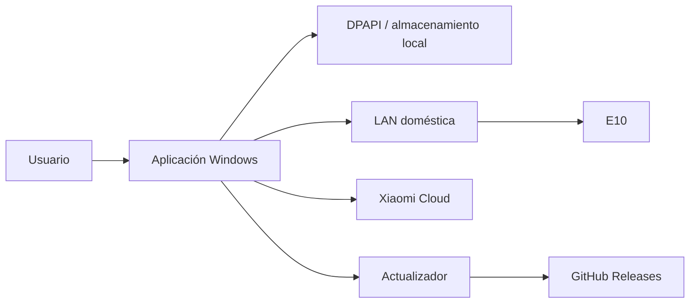

# Modelo de seguridad

## Objetivo

La aplicación controla un dispositivo físico dentro de una red doméstica y, opcionalmente, utiliza servicios Xiaomi Cloud. El objetivo de seguridad es evitar que un fallo del software, una credencial filtrada o una contribución maliciosa permita controlar el robot o acceder a una cuenta de forma no autorizada.

## Activos sensibles

- token miIO del robot;
- credenciales/cookies de Xiaomi Cloud;
- URLs FDS firmadas;
- identificadores de dispositivo;
- archivos de configuración locales;
- datos de mapa e historial;
- canal de actualización;
- permisos del repositorio y GitHub Actions.

## Límites de confianza

No se debe tratar como confiable automáticamente ninguna respuesta de red, archivo descargado, respuesta Cloud o contribución externa.

## Riesgos principales

### 1. Fuga de token o credenciales

Mitigaciones:

- no imprimir secretos completos en F12;
- DPAPI para material persistente;
- secret scanning de GitHub;
- no subir archivos personales;
- sanear diagnósticos antes de compartirlos.

### 2. Actualización comprometida

Mitigaciones:

- releases generadas por GitHub Actions;
- SHA-256 publicado;
- separación entre cambios documentales y releases;
- CODEOWNERS;
- análisis estático y revisión de dependencias.

Objetivo futuro: firma Authenticode del instalador y verificación criptográfica más fuerte del canal de actualización.

### 3. Dependencia comprometida

Mitigaciones:

- Dependabot;
- CodeQL para el código propio;
- versiones acotadas en `requirements.txt` cuando sea posible;
- revisión de cambios en dependencias sensibles.

Objetivo futuro: lockfile reproducible y hashes de paquetes.

### 4. Comando inesperado al robot

Mitigaciones:

- distinguir ACK fuerte de respuestas ambiguas;
- smoke tests de respuestas reales del B112;
- no ejecutar acciones destructivas para “probar” una hipótesis;
- gates antes de movimientos automáticos;
- timeouts y stop seguro.

### 5. Acceso remoto no intencionado

La aplicación no debe exponer un servidor público para controlar el robot. El control LAN está diseñado para redes confiables. Si en el futuro existe acceso remoto, deberá incluir autenticación fuerte, cifrado, revocación y un modelo de permisos explícito.

## Prácticas del repositorio

- `.github/CODEOWNERS` identifica al propietario del código.
- CodeQL analiza cambios de Python.
- Dependabot revisa dependencias y GitHub Actions.
- GitHub secret scanning funciona sobre repositorios públicos compatibles.
- `SECURITY.md` establece divulgación coordinada.
- Las vulnerabilidades no deben publicarse con detalles explotables en Issues.

## Vulnerabilidades

Cuando GitHub Private Vulnerability Reporting esté habilitado, debe utilizarse **Security → Report a vulnerability**. Los detalles técnicos sensibles deben permanecer privados hasta que exista una corrección.

## Lo que GitHub no puede garantizar

Ninguna configuración de GitHub impide que alguien copie contenido que ya fue publicado. La seguridad del repositorio protege integridad, secretos y proceso de desarrollo; no convierte el código público en inaccesible.
